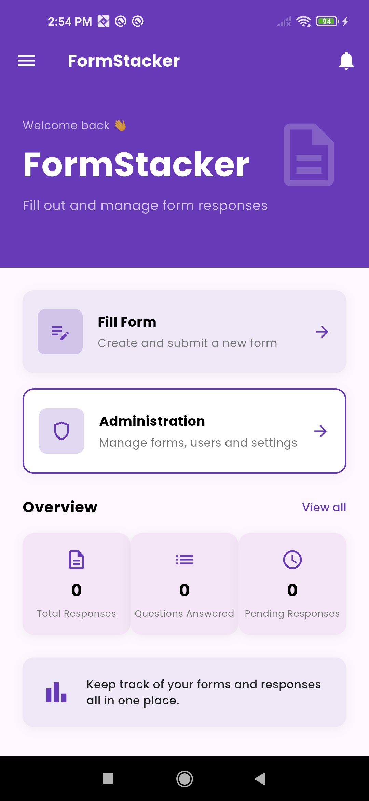
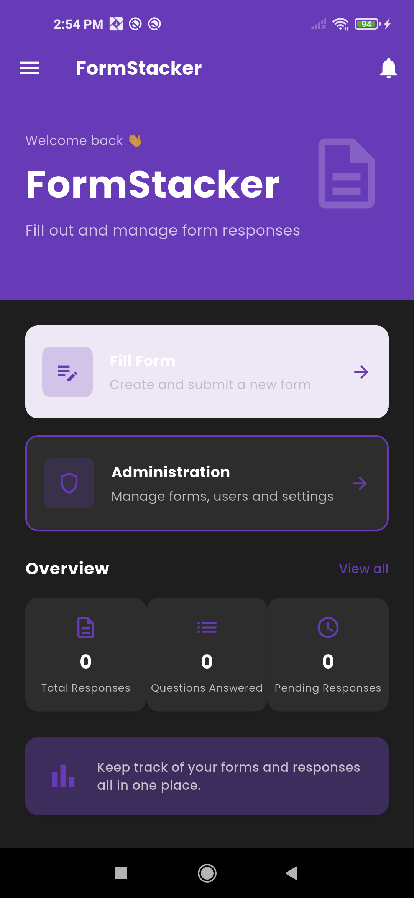
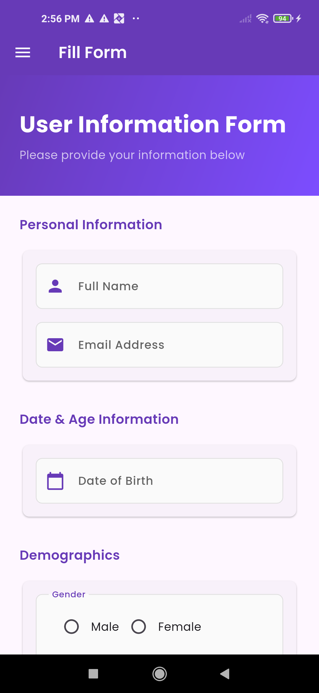
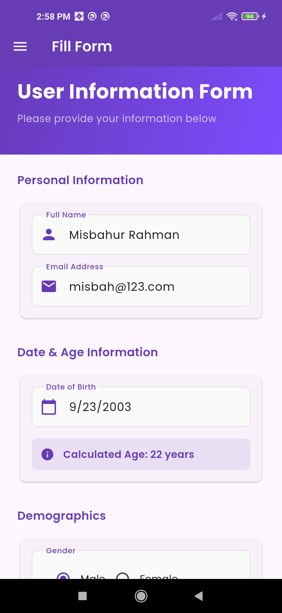
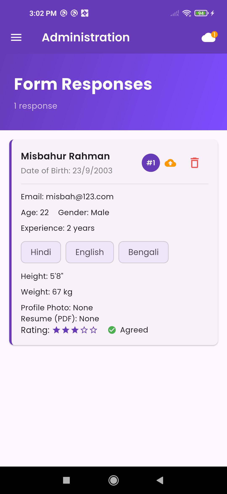
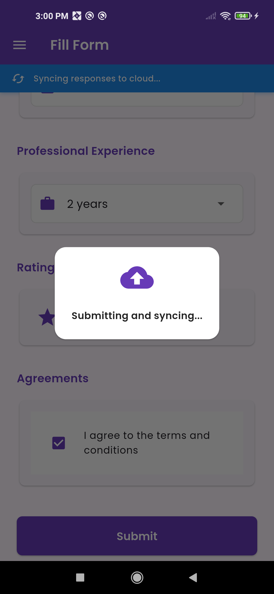
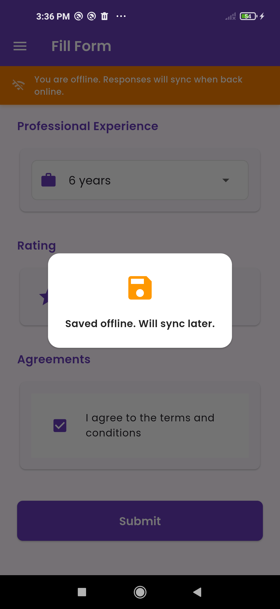

# 📋 FormStacker

A Flutter forms app with offline-first architecture, Firebase sync, 
and a Google Forms-inspired UI.

---

## ✨ Features

- 📝 Multi-field form with validation
- 🌐 Multilingual support (English, Hindi, Bengali)
- 🔒 Password-protected admin panel with secure storage
- 🌙 Dark / Light mode toggle
- 📶 Offline-first with SQLite + Firebase Firestore sync
- 📊 Real-time sync status indicators
- 📁 Photo and resume upload

---

## 📸 Screenshots

### Home Page
| Light Mode | Dark Mode |
|------------|-----------|
|  |  |

### Form Page
| Empty | Filled |
|-------|--------|
|  |  |

### Admin Page


### Sync Status
| Online Syncing | Offline Mode |
|----------------|--------------|
|  |  |

---

## 🏗️ Architecture
lib/
├── main.dart
├── models/
│   └── form_response.dart
├── db/
│   └── database_helper.dart
├── services/
│   ├── sync_service.dart
│   └── connectivity_service.dart
├── store/
│   └── response_store.dart
├── pages/
│   ├── home_page.dart
│   ├── user_form_page.dart
│   └── admin_page.dart
└── widgets/
├── app_drawer.dart
└── sync_status_bar.dart

## 🗄️ Data Flow
User submits form
↓
SQLite (immediate, offline-first)
↓
SyncService → Firebase Firestore
↓
┌─ Online?  → Sync now  → Mark synced ✅
└─ Offline? → Pending   → Auto-sync when back online 🔄

---

## 🛠️ Tech Stack

| Layer | Technology |
|-------|-----------|
| Framework | Flutter 3.x |
| Language | Dart |
| Local DB | SQLite (sqflite) |
| Cloud DB | Firebase Firestore |
| Auth storage | flutter_secure_storage |
| Forms | flutter_form_builder |
| Connectivity | connectivity_plus |
| Fonts | Google Fonts (Poppins) |

---

## 🚀 Getting Started

```bash
git clone https://github.com/33Tsuki/FormStacker.git
cd FormStacker
flutter pub get
flutter run
```

> Add your own `google-services.json` in `android/app/` from 
> Firebase console before running.

---

## 👨‍💻 Built By

Misbahur — B.Tech CS, KIIT University  
Internship project at IDEAS TIH, ISI Kolkata
